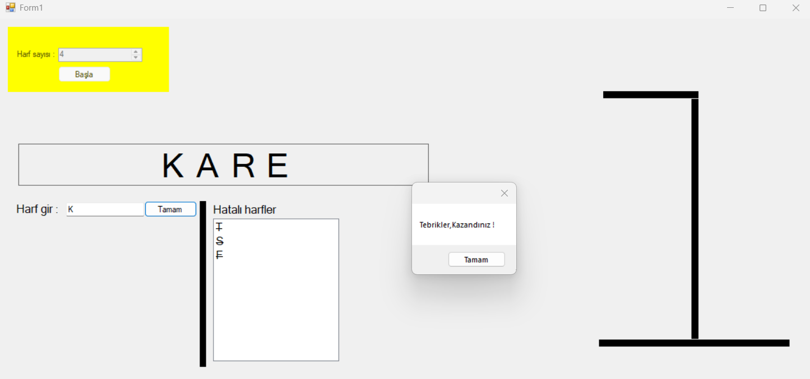

# 😵 Adam Asmaca (Hangman)

C# ve Windows Forms teknolojileri kullanılarak geliştirilmiş, klasik kelime tahmin oyununun dijital masaüstü versiyonudur.

## 📋 Proje Hakkında

Bu uygulama, veritabanından veya tanımlı bir listeden rastgele seçilen kelimeleri, harf tahminleri yaparak bulmaya çalıştığınız eğlenceli bir oyundur. Kullanıcının belirli sayıda hata yapma hakkı vardır; her yanlış tahminde "Adam Asmaca" görseli adım adım tamamlanır.

### 🚀 Özellikler

* **Rastgele Kelime Seçimi:** Her oyunda farklı bir kelime ile başlama.
* **Görsel Geri Bildirim:**
    * ✅ **Doğru Tahmin:** Harf, kelime üzerindeki yerini alır.
    * ❌ **Yanlış Tahmin:** Darağacı ve adam görseli adım adım ekrana gelir.
* **Sanal Klavye / Harf Butonları:** Kullanıcı dostu arayüz ile harf seçimi.
* **Oyun Durumu:** "Kazandınız" veya "Kaybettiniz" uyarıları ve yeniden başlatma seçeneği.

## 🛠️ Teknolojiler

Projede kullanılan temel yapılar:

* **Dil:** C#
* **Arayüz:** Windows Forms Application (WinForms)
* **Algoritma:** String manipülasyonu (Metin parçalama, karakter kontrolü) ve dizi (array) yönetimi.
* **IDE:** Visual Studio

## 🕹️ Nasıl Oynanır?

1.  Oyunu başlattığınızda ekranda gizli kelimenin harf sayısı kadar çizgi (`_ _ _ _`) belirir.
2.  Ekrandaki harf butonlarına tıklayarak tahminlerde bulunun.
3.  Eğer tahmininiz doğruysa, harf ilgili boşluğa yerleşir.
4.  Eğer tahmininiz yanlışsa, "Adam" adım adım çizilmeye başlar.
5.  Adam tamamen asılmadan kelimeyi bulursanız oyunu **kazanırsınız**.

## 📷 Ekran Görüntüsü

